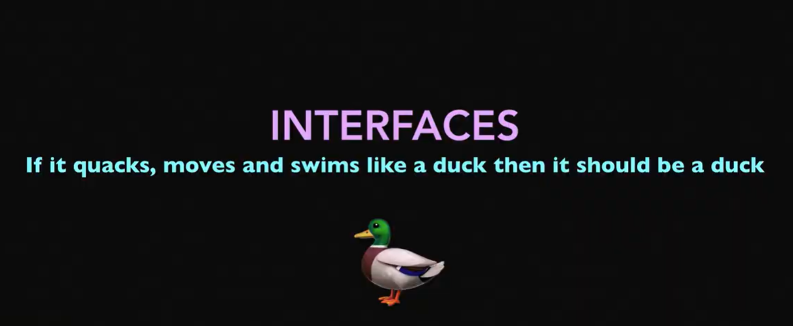
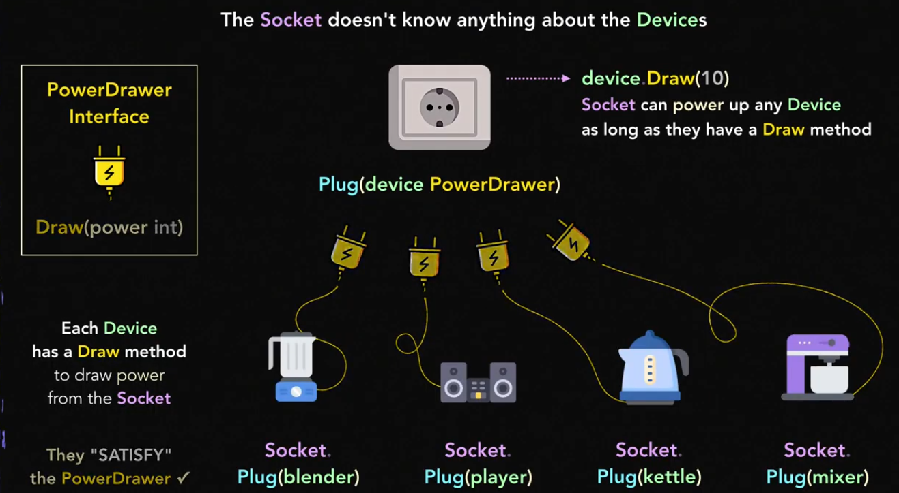
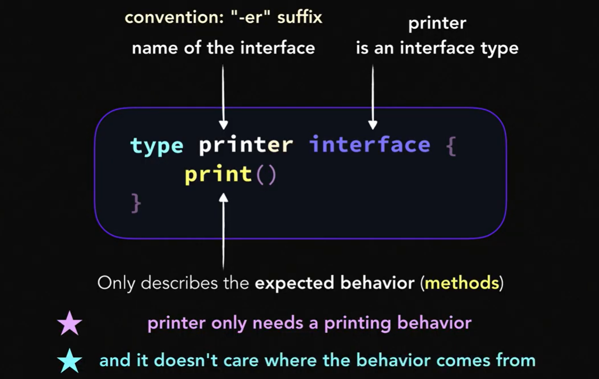
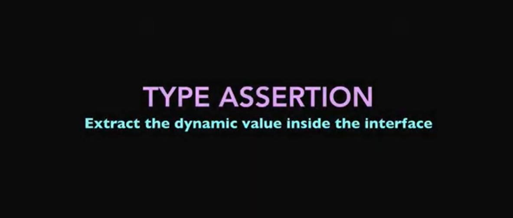
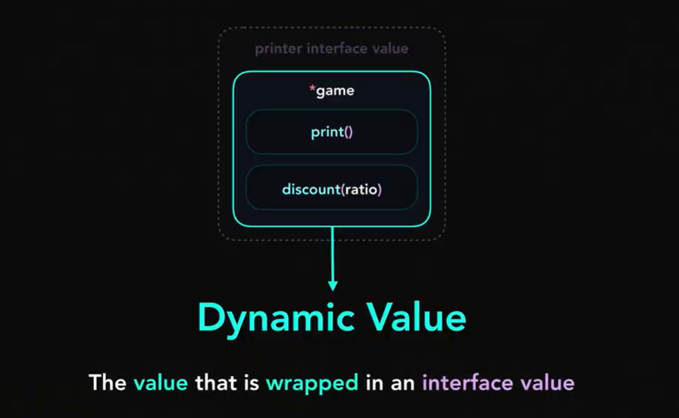
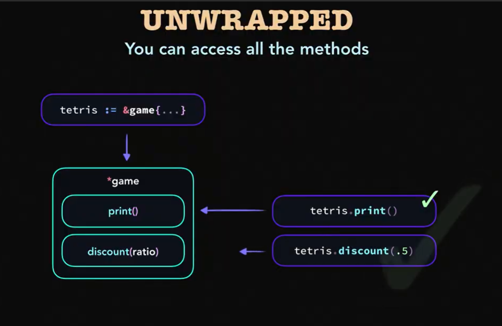
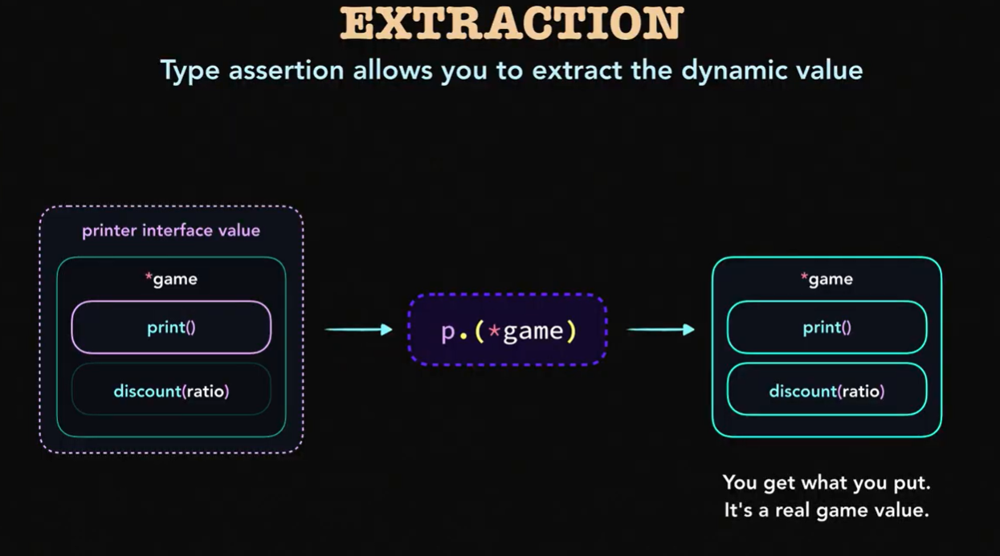
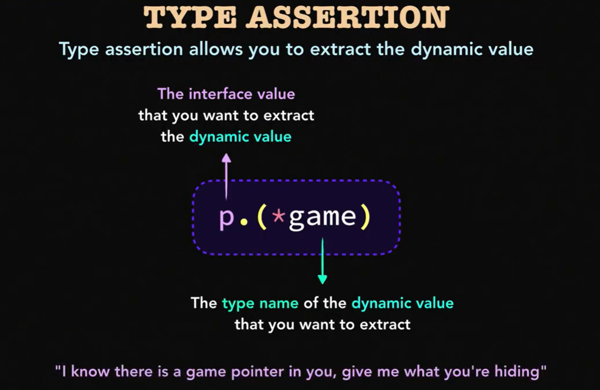

Series số 11 này sẽ tìm hiểu về ```Methods and Interface - Interface and Type assertion ```.
.
# Basic Go 11 - Methods and Interface - Interface and Type assertion 





## Tổng quan về Interface

Trong go, **interface** là một loại dữ liệu trưu tượng (abstract type) cho phép chúng ta định nghĩa một giao thức (**protocal**) hoặc **contract** giữa các data type cụ thể (**concrete types**)

Một khi một data type được implement các method mà một interface yêu cầu, nó được xem là "thực hiện" interface đó.

```yml
fun fact
"Nếu một con vật kêu quack quack, biết bơi và đi lại như vịt thì nó chắc chắn là một con vịt"
Tương tự, nếu một data type có những hành vi giống như những gì interface yêu cầu, thì nó được coi là data type phù hợp với interface đó.
```

Chúng ta sẽ có 2 thuật ngữ cần lưu ý: Đó là **Concrete types** và **Abstract type**

- **Concrete types** : Tất cả các data type không phải interface (như ```struct```, ```int```,```string```,v.v) được gọi là **concrete type**. Đây là data type thực tế mà chúng ta sử dụng nhiều.

- **Abstract types (interface)**: Interface trong Go là một kiểu trưu tượng.

    - Nó chỉ định nghĩa ra một loạt các **Method** mà một kiểu cụ thể nào đó cần phải triển khai.

    - Interface không định nghĩa chi tiết (**behavior**) hành vi của các **Method**, mà chỉ đảm bảo rằng data type nào thực hiện interface đó phải có các **Method** được chỉ định trong Interface.

Cấu trúc của một **Interface** như sau : 



1. ```type printer interface {}```:

    - ```printer``` là tên của Interface.

    - Tên của Interface thường kết thúc bằng "-**er**", như một quy ước đặt tên. Ví dụ: ```printer```, ```writer```, ```reader```. Điều này giúp diễn tả rằng Interface này liên quan đến một **hành vi**(behavior) cụ thể.

2. **Interface là data type:**
     
    - ```printer``` trong ví dụ này là một **Interface type** (kiểu dữ liệu Interface). Các kiểu dữ liệu khác có thể thực hiện (implement) Interface này bằng cách cung cấp Method mà Interface yêu cầu.

3. **Method trong Interface:**

    -```print()``` là Method mà bất kỳ kiểu dữ liệu nào muốn thực hiện Interface ```printer``` đều phải có. Method này không có phần thân, chỉ định nghĩa **hành vi**(behavior) mà kiểu dữ liệu phải cung cấp.

**Nhưng điểm quan trọng của Interface***:

- **Chỉ mô tả hành vi mong đợi**: Interface chỉ mô tả các Method (hành vi) mà đối tượng phải thực hiện, nó không quan tâm đến cách thức hay nơi các Method này được triển khai.

- **Interface không quan tâm nguồn gốc của hành vi**: Interface không cần biết hành vi đó đến từ đâu, miễn là đối tượng thực hiện đầy đủ các Method trong Interface.

## File code

```go
    //book.go

    package main

    import "fmt"

    type book struct {
        title string
        price money
    }

    func (b book) print() {
        fmt.Printf("%-15s: %s\n", b.title, b.price.string())
    }
```

```go
    //game.go

    package main

    import "fmt"

    type game struct {
        title string
        price money
    }

    func (g *game) print() {
        fmt.Printf("%-15s: %s\n", g.title, g.price.string())
    }

    func (g *game) discount(ratio float64) {
        g.price *= money(1 - ratio)
    }
```

```go
    // list.go

    package main

    import "fmt"

    type printer interface {
        print()
    }

    type list []printer

    func (l list) print() {
        if len(l) == 0 {
            fmt.Println("Sorry. We're waiting for delivery 🚚.")
            return
        }

        for _, it := range l {
            // fmt.Printf("(%-10T) --> ", it)

            it.print()

            // you cannot access to the discount method of the game type.
            // `it` is a printer not a game.
            // it.discount(.5)
        }
    }
```

```go
    // main.go

    package main

    import "fmt"

    func main() {
        var (
            mobydick  = book{title: "moby dick", price: 10}
            minecraft = game{title: "minecraft", price: 20}
            tetris    = game{title: "tetris", price: 5}
            rubik     = puzzle{title: "rubik's cube", price: 5}
        )

        // only rule: they need to implement the `printer` interface.
        // to do that: each type needs to have a print method.

        var store list
        store = append(store, &minecraft, &tetris, mobydick, rubik)
        store.print()

        // interface values are comparable
        fmt.Println(store[0] == &minecraft)
        fmt.Println(store[3] == rubik)
    }
```
```go
    //money.go

    package main

    import "fmt"

    type money float64

    func (m money) string() string {
        return fmt.Sprintf("$%.2f", m)
    }
```

```go
    // puzzle.go

    package main

    import "fmt"

    type puzzle struct {
        title string
        price money
    }

    // if you remove this method,
    // you can no longer add it to the `store` in `main()`.
    func (p puzzle) print() {
        fmt.Printf("%-15s: %s\n", p.title, p.price.string())
    }
```

Chúng ta có: 

-  ```book.go``` : Type ```book``` và Method ```print()```

-  ```game.go``` : Type ```game``` và Method ```print()``` ,```discount```.

-  ```puzzle.go``` : Type ```puzzle``` và Method ```print()```

- ```list.go``` : Interface ```printer``` và Type ```list``` chứa các đối tượng thực hiện interface này.

Chúng ta thấy rằng trong file ```list.go``` có định nghĩa một **Interfaces** ```printer``` và yêu cầu Method ```print()``` phải được triển khai bơii các Data type tham gia vào.

Và ở file ```main.go``` có ```var store list``` biến **store** thuộc type list và list này là một ```slice``` của các đối tượng thực hiện interface ```printer```. Nói cách khác thì ```list``` là 1 danh sách (slice) chứa các đối tượng có Method ```print()``` (Các đối tượng thực hiện interface ```printer```).

Đối với Go sẽ sử dụng cơ chế **duck typing** : "Nếu một data type đi lại, bơi và kêu quack quack như một con vịt thì nó là một con vịt". Cụ thể trong trường hợp của chúng ta.

- **Nếu một data type có method print()**, nó có thể được coi là một ```printer```. Chúng ta không cần phải khai báo cụ thể rằng ```book```, ```game```, hay ```puzzle``` "thực hiện" interface ```printer``` Miễn là chúng có **Method** ```print()``` thì sẽ tự động thoả mãn yêu cầu của interface.


## **Concrete type**

Như đã đề cập ban đầu. Tất cả các kiểu dữ liệu không phải là interface được gọi là **concrete types.**

Đây là các kiểu cụ thể như ```book```, ```game```, và ```puzzle```, đã được định nghĩa trong các file ```book.go```, ```game.go```, và ```puzzle.go```.

**Giải thích chi tiết về Concrete Types**

Một **concrete type** là một kiểu có định nghĩa đầy đủ về dữ liệu mà nó lưu trữ và các **Method** mà nó cung cấp. Các kiểu như ```int```, ```float64```, ```struct```, và bất kỳ ```struct``` tùy chỉnh nào mà chúng ta định nghĩa đều là **concrete types**.

Trong ví dụ của chúng ta:

- ```book``` là một **concrete type** được định nghĩa với các trường ```title``` và ```price```. Nó có một **Method** ```print()``` để in thông tin chi tiết về cuốn sách.

- ```game``` là một **concrete type** với các trường tương tự như book, nhưng thêm **Method** ```discount()``` để thay đổi giá.

- ```puzzle``` là một **concrete type** cũng với các trường title và price, có **Method** ```print()``` để thoả mãn interface ```printer```.

Các concrete type như ```book```, ```game```, và ```puzzle``` có thể được lưu trữ trong một ```list``` (được định nghĩa là một slice của printer). Khi chúng ta thêm các đối tượng như ```&minecraft```, ```&tetris```, ```mobydick```, và ```rubik``` vào ```store``` trong ```main.go```, điều này minh hoạ rằng các concrete types này hoàn toàn tương thích với interface ```printer```:

```go
    var store list
    store = append(store, &minecraft, &tetris, mobydick, rubik)
```

Ở đây, ```store``` chứa một tập hợp các giá trị là các concrete types khác nhau (```*game```, ```book```, ```puzzle```), tất cả đều thực hiện interface ```printer```.

## Type Assertion

**Code File**

```go
    //book.go
    package main

    import "fmt"

    type book struct {
        title string
        price money
    }

    func (b book) print() {
        fmt.Printf("%-15s: %s\n", b.title, b.price.string())
    }
```

```go
    //game.go
    package main

    import "fmt"

    type game struct {
        title string
        price money
    }

    func (g *game) print() {
        fmt.Printf("%-15s: %s\n", g.title, g.price.string())
    }

    func (g *game) discount(ratio float64) {
        g.price *= money(1 - ratio)
    }
```
```go
    //list.go
    package main

    import "fmt"

    type printer interface {
        print()

        // use type assertion when you cannot change the interface.
        // discount(ratio float64)
    }

    type list []printer

    func (l list) print() {
        if len(l) == 0 {
            fmt.Println("Sorry. We're waiting for delivery 🚚.")
            return
        }

        for _, it := range l {
            it.print()
        }
    }

    // type assertion can extract the wrapped value.
    // or: it can put the value into another interface.
    func (l list) discount(ratio float64) {
        // you can declare an interface in a function/method as well.
        // interface is just a type.
        type discounter interface {
            discount(float64)
        }

        for _, it := range l {
            // you can assert to an interface.
            // and extract another interface.
            if it, ok := it.(discounter); ok {
                it.discount(ratio)
            }
        }
    }
```
```go
    //main.go
    package main

    func main() {
        var (
            mobydick  = book{title: "moby dick", price: 10}
            minecraft = game{title: "minecraft", price: 20}
            tetris    = game{title: "tetris", price: 5}
            rubik     = puzzle{title: "rubik's cube", price: 5}
            yoda      = toy{title: "yoda", price: 150}
        )

        var store list
        store = append(store, &minecraft, &tetris, mobydick, rubik, &yoda)

        store.discount(.5)
        store.print()


    }
```

```go
    //money.go
    package main

    import "fmt"

    type money float64

    func (m money) string() string {
        return fmt.Sprintf("$%.2f", m)
    }
```

```go
    //puzzle.go
    package main

    import "fmt"

    type puzzle struct {
        title string
        price money
    }

    func (p puzzle) print() {
        fmt.Printf("%-15s: %s\n", p.title, p.price.string())
    }
```

```go
    // toy.go
    package main

    import "fmt"

    type toy struct {
        title string
        price money
    }

    func (t *toy) print() {
        fmt.Printf("%-15s: %s\n", t.title, t.price.string())
    }

    func (t *toy) discount(ratio float64) {
        t.price *= money(1 - ratio)
    }
```




Khi làm việc với các interface trong Go, một khái niệm quan trọng là type assertion. Đây là cách để trích xuất giá trị động được bọc trong interface và truy cập đầy đủ các Method cũng như dữ liệu của nó.




1. **Interface value Và Dynamic value**

    - **Interface value:** Một giá trị interface trong Go không lưu trữ trực tiếp dữ liệu mà bọc (wrap) và ẩn (hides) giá trị thực bên trong, được gọi là **Dynamic value**. 

    - **Dynamic Value**: Giá trị thực được bọc bên trong interface có thể là bất kỳ kiểu nào miễn là nó thỏa mãn interface đó. Bạn có thể thay đổi giá trị động này tại thời điểm runtime, miễn là kiểu mới tiếp tục thỏa mãn interface.




2. **Sự khác biệt giữa Wrapped và Unwrapped**.

    - **Wrapped**: Khi giá trị vẫn còn được bọc trong interface, bạn chỉ có thể gọi các Method được định nghĩa trong interface đó. Các Method khác của kiểu cụ thể sẽ không thể truy cập được.

    - **Unwrapped**: Khi bạn dùng type assertion để trích xuất giá trị động, bạn có thể truy cập tất cả các Method và thuộc tính của kiểu cụ thể. Điều này giúp bạn làm việc với các Method mở rộng không có trong interface.

3. **Type Assertion**





**Type assertion** cho phép bạn lấy giá trị động từ một interface. Cách thực hiện **type assertion**:

- Cú pháp: ```value, ok := interfaceValue.(ConcreteType).```

- ```interfaceValue```: Giá trị interface mà bạn muốn trích xuất.

- ```ConcreteType```: Tên kiểu của giá trị động mà bạn muốn trích xuất.

- ```ok```: Boolean xác nhận type assertion có thành công hay không.

**Ví dụ**

Trong ví dụ của chúng ta, bạn có thể sử dụng type assertion để truy cập method ```discount()``` chỉ có trong ```game``` và ```toy```:
```go
    func (l list) discount(ratio float64) {
        type discounter interface {
            discount(float64)
        }

        for _, it := range l {
            // Type assertion để kiểm tra và trích xuất giá trị động
            if it, ok := it.(discounter); ok {
                it.discount(ratio)
            }
        }
    }
```

- Ở đây, chúng ta duyệt qua từng phần tử trong ```list``` và sử dụng ```type assertion``` ```it.(discounter)``` để kiểm tra xem phần tử có thực hiện interface ```discounter``` (có method ```discount()```) hay không.

- Nếu ```type assertion``` thành công (```ok == true```), ```it``` sẽ là một giá trị ```discounter``` và ta có thể gọi method ```discount()``` trên đó.


```go
    func main() {
        var (
            mobydick  = book{title: "moby dick", price: 10}
            minecraft = game{title: "minecraft", price: 20}
            tetris    = game{title: "tetris", price: 5}
            rubik     = puzzle{title: "rubik's cube", price: 5}
            yoda      = toy{title: "yoda", price: 150}
        )

        var store list
        store = append(store, &minecraft, &tetris, mobydick, rubik, &yoda)

        // Áp dụng giảm giá với type assertion
        store.discount(.5)
        store.print()
    }
```

- ```store.discount(.5)``` sẽ gọi method ```discount()``` của bất kỳ phần tử nào trong ```store``` có method này, nhờ vào type assertion.


