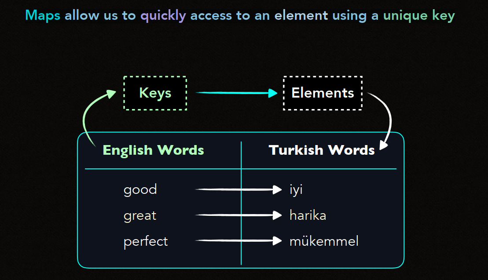
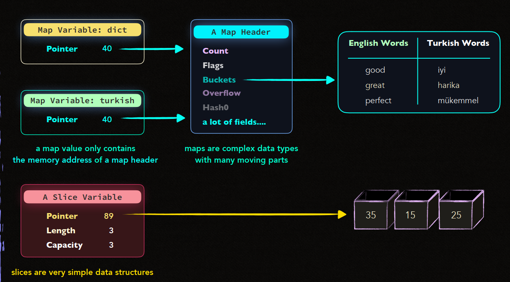

Trước đó chúng ta đã tìm hiểu về `Composite Types- Slice`.
Series số 6 này sẽ tìm hiểu về `Composite Types - Map`.
.

# Basic Go 6 - Composite Types - Map

# Maps

- **Map** là 1 collection có các cặp **Key-Value** và có thể truy cập nhanh tới giá trị bằng **Key**.

- Map thường được sử dụng khi cần ánh xạ một khoá cụ thể tới một giá trị tương ứng.

- **Key** Trong map phải là **unique**. Nếu hai **key** trùng nhau, map sẽ chỉ lưu giá trị của **key** cuối cùng.

- **Key-Value** Mismatches.

  - **Key** và **Value** trong map không cần phải thuộc cùng 1 kiểu. Chúng có thể là kiểu khác nhau.

- Các **key** trong map cần phải là **comparable types** (các kiểu có thể so sánh được) như: `int`, `string`, `bool`. Các kiểu như **slice**, **map**, và **function** không thể làm **key** vì chúng không hỗ trợ so sánh.

- Map internals :

  - Map trong Go là 1 cấu trúc dữ liệu phức tạp, với nhiều **moving parts**.

  - Một biến map thực chất là một **pointer** tới một **map header** trong bộ nhớ

  - **Map header** chứa nhiều thông tin như **buckets**, **overflow**,**count**,**hash** và các thành phần khác để quản lý dữ liệu trong map.

- Cloning Maps

  - Khi bạn tạo một map mới từ một map đã có (clone), hai biến map sẽ trỏ đến cùng một map header trong bộ nhớ. Điều này có nghĩa là nếu bạn thay đổi map clone, map gốc cũng sẽ thay đổi.

- Dynamic Nature

  - Map trong Go có kích thước động và có thể tự mở rộng khi cần thêm nhiều cặp **key-value** hơn, tương tự như **slice** có thể mở rộng khi thêm phần tử mới. Tuy nhiên, map phức tạp hơn slice rất nhiều vì có thêm cơ chế **hashing** và **bucket** để quản lý dữ liệu.
