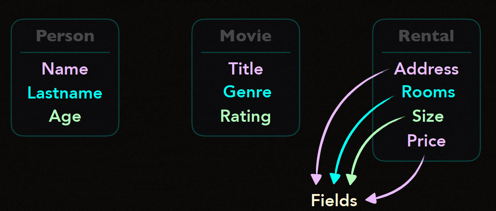
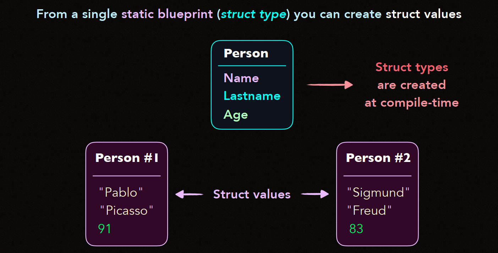
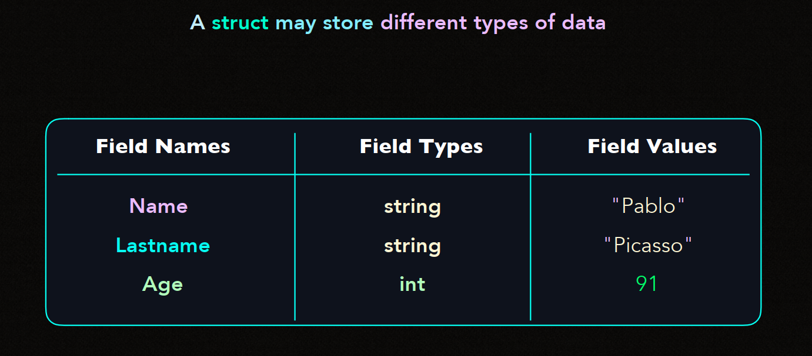
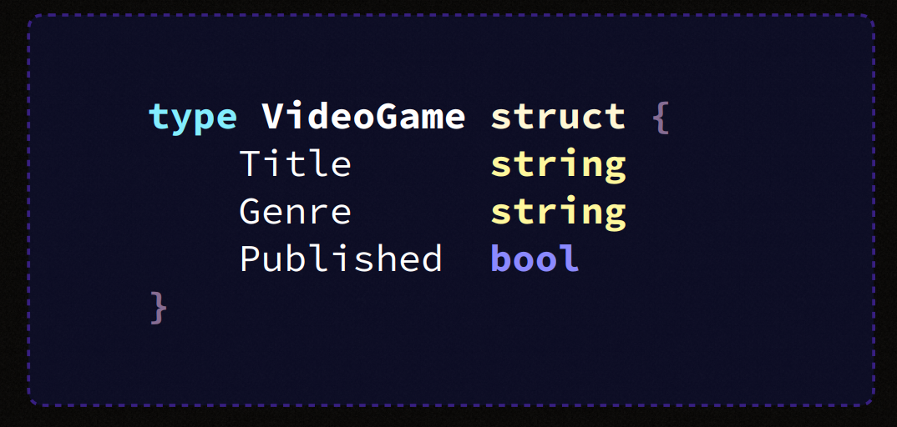
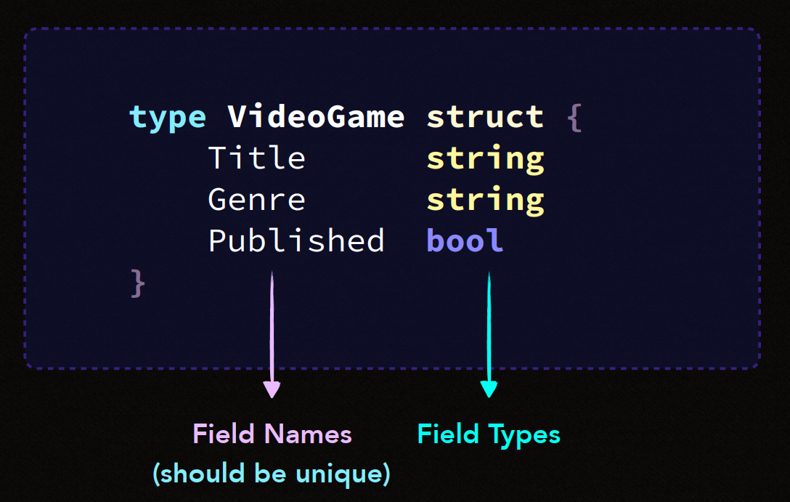
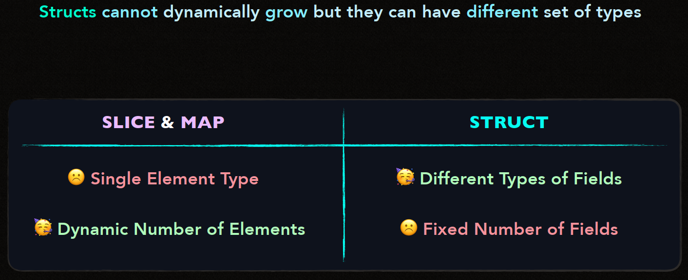
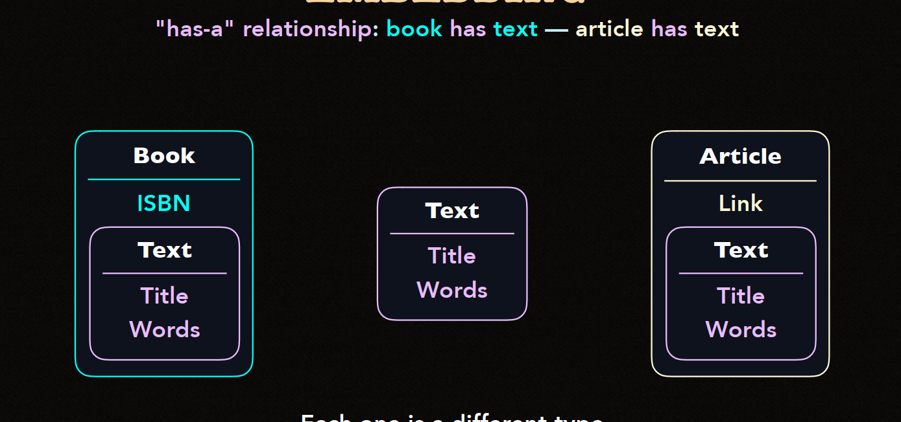
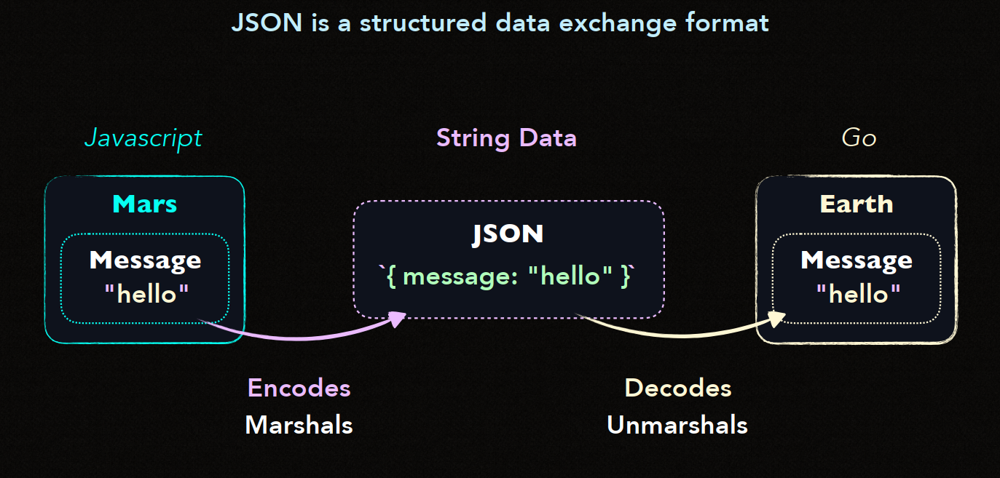
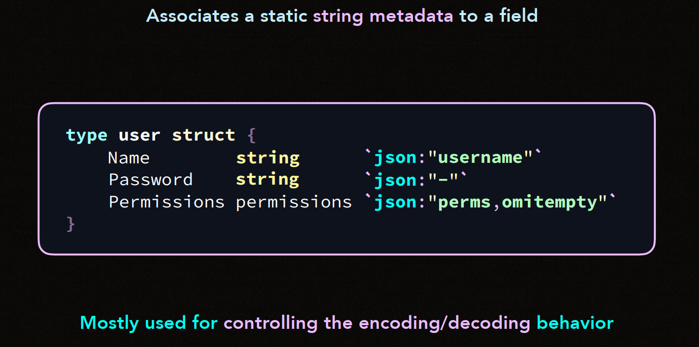
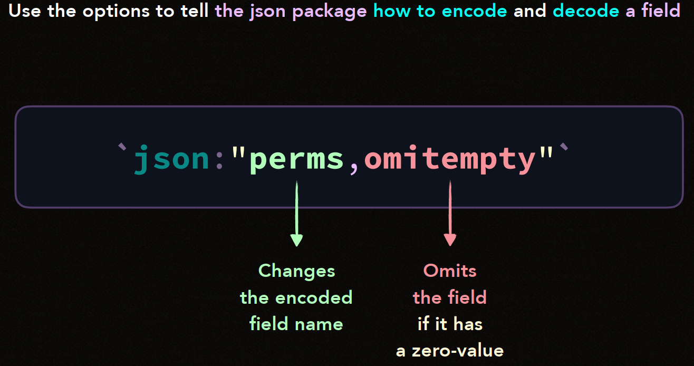

Series số 7 này sẽ tìm hiểu về `Composite Types - STRUCTS`.
.

# Basic Go 7 - Composite Types - STRUCTS


- Trong Go, `struct` là một kiểu dữ liệu cho phép chúng ta đại diện cho các khái niệm phức tạp bằng cách **nhóm** các trường dữ liệu (fields) liên quan thành một kiểu duy nhất.

- `Struct` rất hữu ích khi bạn muốn quản lý các dữ liệu phức tạp theo cấu trúc.

- Về bản chất, `struct` có chức năng tương tự như **class** trong các Ngôn ngữ lập trình hướng đối tượng khác, Nhưng Go không hỗ trợ OOP theo cách truyền thống, nên `struct` trong Go không có tính kế thừa (**inheritance**) như class.



## Struct như 1 Blueprint (bản thiết kế)

- Hãy tưởng tượng `struct` như 1 **bản thiết kế** (blueprint) cố định.

- Sau khi định nghĩa, struct hoạt động như 1 **template** (mẫu) mà bạn có thể dùng để tạo ra nhiều **instance** từ nó.

- Mỗi **instance** đều tuân thủ theo cấu trúc của bản thiết kế ban đầu nhưng mang dữ liệu riêng biệt.

- Tóm lại :

  - `Struct` là một **bản thiết kế**, và các instance (bản thể) của nó là các đối tượng độc lập.

  - Mỗi instance được tạo ra từ bản thiết kế là một thực thể duy nhất với dữ liệu riêng biệt.




Đặc điểm của Struct trong Go.

1. **Struct là 1 bản thiết kế cố định**: Được cố định từ lúc compile-time (lúc biên dịch), nghĩa là bạn không thể thay đổi cấu trúc của nó sau khi đã định nghĩa.
   `static blueprint`.

2. **Fixed at Compile-time** Cố định tai thời điểm biên dịch : Một khi struct đã được định nghĩa thì bạn không thể thêm hoặc xoá các fields của nó sau khi biên dịch.

3. **Groups related data in a single type**: Nhóm các dữ liệu liên quan. Bằng cách định nghĩa một khái niệm vào một kiểu duy nhất, giúp quản lý dữ liệu dễ dàng hơn và source code dễ đọc hơn.

4. **No inheritance** : Không có tính kế thừa, Struct trong Go không hỗ trợ tính kế thừa. Nhưng lại cho phép bạn embed (nhúng) các struct khác nhau vào trong nhau để đạt hiểu quả tương tự.

Example :

```go
    type Book struct {
        Title string
        Author string
        ISBN string
        Published int
        Available bool
    }

    // create a instance of Book

    book1 := Book{
        Title:     "The Go Programming Language",
        Author:    "Alan A. A. Donovan and Brian W. Kernighan",
        ISBN:      "9780134190440",
        Published: 2015,
        Available: true,
    }

    book2 := Book{
        Title:     "Clean Code",
        Author:    "Robert C. Martin",
        ISBN:      "9780132350884",
        Published: 2008,
        Available: false,
    }

```

- `Book` là 1 struct có các field là `Title`,`Author`,`ISBN`,`Published` và `Available`.

- Các instance được tạo ra `book1` và `book2` là instance của `Book`

- Mỗi instance duy trì trạng thái (state) và dữ liệu riêng biệt, độc lập với nhau.

```go

    fmt.Println("Title",book1.Title)
    fmt.Println("Available:", book1.Available)

    book1.Available = false
```

- Get value của 1 struct thông qua toán tử dấu chấm (`.`).

- Định nghĩa các Method cho Struct:

Mặc dù Go không hỗ trợ class, nhưng bạn vẫn có thể định nghĩa các Method trên struct, Phương thức trong Go cho phép struct có các hành vi riêng, giúp tổ chức source code tốt hơn.

```go
    func (b Book) DisplayInfo(){
        fmt.Printf("'%s' by %s (ISBN: %s)\n", b.Title, b.Author, b.ISBN)
    }

    func (b *Book) SetAvailability(status bool){
        b.Available = status
    }
```

```go
    book1.DisplayInfo()
    book1.SetAvailability(true)
    fmt.Println("Updated Availability:", book1.Available)
```

- `Struct` là một kiểu dữ liệu phức hợp cho phép bạn lưu trữ liệu loại dữ liệu khác nhau trong cùng một instance.







- Và đương nhiên phải xác định rõ ràng thời điểm **Compile-time** và **runtime**

- Đối với **Compile-time**: Đây là thời điểm khi source code được biên dịch thành chương trình thực thi. Tại đây, Các field các type data của `struct` được xác định và cố định không thay đổi.

- Đối với **Runtime** : Đây là thời điểm khi chương trình thực thi.Thì các value của các field có thể thay đổi.



## EMBEDDING

- **"has-a" relationship: book has text — article has text**.



- Các bạn đã biết về quan hệ "**has-a** trong lập trình rồi là quan hệ 1-n .

- Một đối tượng sở hữu 1 hoặc nhiều đối tượng khác.

- Một **Book** có Một **Text**.

- Một **Article** có Một **Text**.

- Và Mỗi Cá nhân nó đều có dữ liệu khác nhau.

```go

    type Book struct {
        ISBN   string
        Title  string
        Words  int
        Text   string
    }

    type Article struct {
        Link   string
        Title  string
        Words  int
        Text   string
    }

```

## ANONYMOUS FIELDS trong Embedding.

- Là cách khai báo một field trong một struct mà không cần đặt tên cho trường đó.

- Thay vào đó ta chỉ cần định nghĩa kiểu dữ liệu của fields.

- Anonymous fields cho phép sử dụng các trường của field của struct được nhúng vào mà không cần truy cập qua tên field.

```go
package main

import "fmt"

type Person struct {
    Name string
    Age int
}

type Employee struct {
    Person
    Position string
    Salary int
}

func main(){
    emp := Employee{
        Person:person {
            Name:"Viet hoang",
            Age : 30,
        },
        Position: "Backend Dev",
        Salary : 10000
    }

    fmt.Println("Name:", emp.Name)
    fmt.Println("Age:", emp.Age)
    fmt.Println("Position:", emp.Position)
    fmt.Println("Salary:", emp.Salary)
}
```

- Trong `struct` Employee thì Person được khai báo như một anonymous field.

- Điều này cho phép ta truy cập trực tiếp các trường của `Person` (như `Name` và `Age`) từ đối tượng `Employee` mà không cần dùng đến e`mp.Person.Name`.

- Và một điều quan trọng đó là **When the field names conflict the parent type takes priority**.

- Nghĩa là nếu bị conflig field thì sẽ ưu tiên field thuộc Struct cha.

```go

    type Person struct {
        Name string
        Age  int
    }

    type Employee struct {
        Person         // Struct nhúng (anonymous field)
        Name   string  // Field trùng tên với trường trong `Person`
        Salary int
    }
```

- Vậy nên sẽ ưu tiên Employee hơn là Person.


## LOG PARSER

- Log Parser có thể được cải tiến bằng cách sử dụng `Struct`.

```go
    type LogEntry struct {
        Timestamp string
        Level     string
        Message   string
    }

    func ParseLog(entry string) LogEntry {
        return LogEntry{
            Timestamp: "2023-10-28 10:45",
            Level:     "INFO",
            Message:   "Log message content",
        }
    }
```

## JSON ENCODING

- **Why you might want to use JSON data exchange format?**

- Bạn chỉ cần nhớ 3 câu:

- **Human Readable**

- **Computers can easily to understand it**

- **Widely used and supported**

```go
    type User struct {
        Name  string `json:"name"`
        Email string `json:"email"`
        Age   int    `json:"age"`
    }
```



## FIELD TAGS

- Trong Go, `field tags` là một `chuỗi metadata tĩnh` được gán cho một field nào đó trong `struct`.

- Các field tag này **không tự có ý nghĩa**, mà thay vào đó chúng được các thư viên như `json` hay `xml` đọc để **encode** và **decode**.

- Các tính năng của Field Tags.

  - **Dùng để kiểm soát hành vi của encoding/ decoding**.

  - **Không có ý nghĩa riêng lẻ**: Bản thân các field tags không có ý nghĩa đặc biệt, mà **phụ thuộc vào package** sử dụng chúng, ví dụ như json hoặc xml.

  - **Chuỗi ký tự đặc biệt**: Field tags thường là chuỗi ký tự nằm trong dấu nháy kép (`""`).

```go
    type Product struct {
        ID       int    `json:"id"`
        Name     string `json:"name,omitempty"`
        Price    float64 `json:"price"`
    }
```

- `json:"id"` : Chỉ định rằng trường `ID` sẽ được encode thành `"id"` trong JSON.

- `json:"name,omitempty"`: `omitempty` giúp bỏ qua trường `Name` nếu nó trống.






## JSON DECODING

```go
    package main

    import (
        "encoding/json"
        "fmt"
    )

    type User struct {
        Name  string `json:"name"`
        Email string `json:"email"`
        Age   int    `json:"age"`
    }

    func main() {
        jsonData := `{"name": "Alice", "email": "alice@example.com", "age": 25}`

        var user User
        err := json.Unmarshal([]byte(jsonData), &user)
        if err != nil {
            fmt.Println("Error decoding JSON:", err)
            return
        }

        fmt.Printf("Name: %s\nEmail: %s\nAge: %d\n", user.Name, user.Email, user.Age)
    }
```

- Sử dụng `json.Unmarshal` để chuyển đổi `jsonData` và `user` struct.

- **Field tags như `json:"name"` ** cho thư viện `json` biết cách map trường JSON vào các field của `struct`.

- Nếu không biết trước cấu trúc của Json hoặc cấu trúc quá phức tạp.

- Bạn có thể dùng `map[string]interface{}` để lưu dữ liệu Json. Điều này linh hoạt hơn khi decode JSON không cố định cấu trúc.

```go
    package main

    import (
        "encoding/json"
        "fmt"
    )

    func main() {
        jsonData := `{"name": "Alice", "email": "alice@example.com", "age": 25, "extra": "value"}`

        var result map[string]interface{}
        err := json.Unmarshal([]byte(jsonData), &result)
        if err != nil {
            fmt.Println("Error decoding JSON:", err)
            return
        }

        fmt.Printf("Name: %s\n", result["name"])
        fmt.Printf("Email: %s\n", result["email"])
        fmt.Printf("Age: %v\n", result["age"])
    }

```

- `json.Unmarshal` chuyển dữ liệu JSON vào một `map[string]interface{}`, cho phép bạn truy cập từng phần tử bằng tên trường mà không cần biết kiểu dữ liệu trước.
